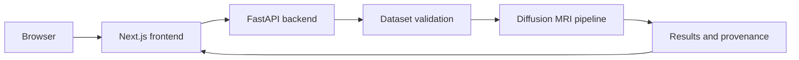

# NeuroTract

NeuroTract is a diffusion MRI research workstation for tractography, structural connectome construction, graph analysis, provenance inspection, and interactive 2D/3D result exploration.

It is research software. Reconstructed streamlines are computational trajectories inferred from diffusion data, not literal axons. The application does not provide medical diagnoses, treatment recommendations, or a clinical health score.

## Contents

- [What it does](#what-it-does)
- [Architecture](#architecture)
- [Run locally](#run-locally)
- [Upload and process a dataset](#upload-and-process-a-dataset)
- [Tests](#tests)
- [Deployment](#deployment)
- [Documentation](#documentation)

## What it does

- Validates a 4D diffusion NIfTI file with its matching b-values and b-vectors before processing.
- Performs preprocessing, DTI fitting, CSD/FOD estimation, probabilistic tractography, surface generation, connectome construction, and graph metrics.
- Streams job milestones and telemetry to the web interface through server-sent events.
- Stores checksums, parameters, random seed, and software versions with generated results.
- Displays streamlines, orthogonal slices, connectome data, and graph metrics in a Next.js/Three.js interface.

## Architecture



## Run locally

Requirements: Python 3.10+ and Node.js 18+.

```powershell
python -m venv .venv
.\.venv\Scripts\Activate.ps1
pip install -r requirements.txt

cd src/frontend
npm ci
cd ../..
```

Start the backend:

```powershell
.\.venv\Scripts\python.exe -m uvicorn src.backend.api.server:app --host 0.0.0.0 --port 8000
```

In a second terminal, start the frontend:

```powershell
cd src/frontend
$env:NEXT_PUBLIC_API_URL = 'http://localhost:8000'
npm run dev
```

Open `http://localhost:3000`. The API reference is available at `http://localhost:8000/docs`.

## Upload and process a dataset

Select all three files in **Upload New Data**:

1. One 4D DWI NIfTI: `.nii` or `.nii.gz`
2. The corresponding b-values: `.bval` or `.bvals`
3. The corresponding b-vectors: `.bvec` or `.bvecs`

The application places them in one upload session, checks file integrity, volume/gradient compatibility, b0 presence, and gradient shape, then shows **Validated and ready for processing** only when those checks pass. Select **Start pipeline** to queue the real processing job and follow progress in the execution panel.

Source datasets, uploads, output artifacts, job state, and logs are excluded from Git. Bring your own appropriately authorised research data.

## Tests

```powershell
.\.venv\Scripts\pytest.exe -v
cd src/frontend
npm run type-check
npm run build
```

## Deployment

Use Vercel for the frontend and Render (or a comparable persistent Python host) for the backend. Vercel by itself cannot host the current scientific processing service reliably because it needs Python dependencies, long-running work, writable storage, and persistent job state.

Configure Vercel with root directory `src/frontend` and set `NEXT_PUBLIC_API_URL` to the deployed FastAPI URL. For Render, install `requirements.txt` and run:

```text
uvicorn src.backend.api.server:app --host 0.0.0.0 --port $PORT
```

Attach persistent storage for uploads and results, and use a durable worker queue for production processing. The full deployment checklist, operational cautions, and scaling notes are in the project guide.

## Documentation

The complete indexed reference is in [docs/PROJECT_GUIDE.md](docs/PROJECT_GUIDE.md). It covers the processing flow, scientific safeguards, API, repository layout, local development, testing, deployment, and operational considerations.

## License

MIT. See [LICENSE](LICENSE).
