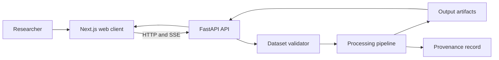
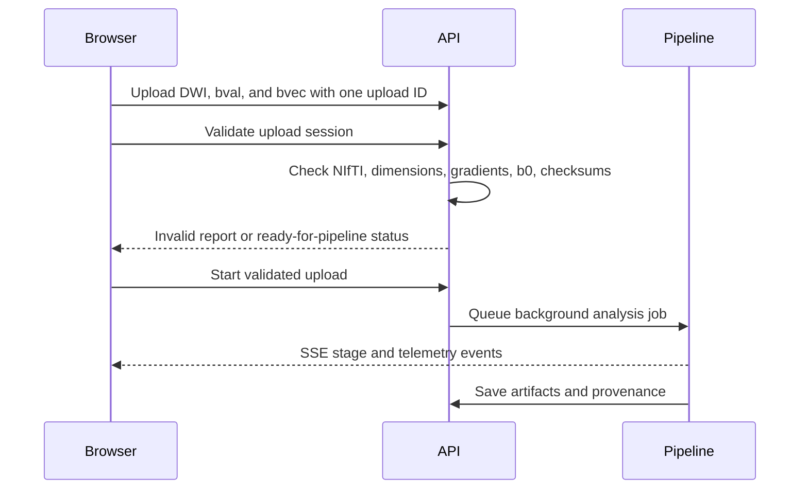
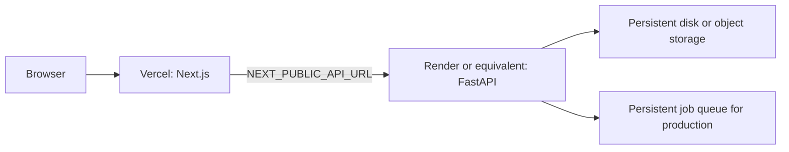

# NeuroTract project guide

## Contents

1. [Purpose and scope](#purpose-and-scope)
2. [Architecture](#architecture)
3. [Data ingestion and processing](#data-ingestion-and-processing)
4. [Scientific safeguards](#scientific-safeguards)
5. [Repository layout](#repository-layout)
6. [Local development](#local-development)
7. [API summary](#api-summary)
8. [Testing and verification](#testing-and-verification)
9. [Deployment](#deployment)
10. [Operational notes](#operational-notes)

## Purpose and scope

NeuroTract is a research workstation for diffusion MRI processing, tractography, structural connectome construction, and interactive inspection of produced artifacts. It is not a diagnostic system. Reconstructed streamlines are algorithmic paths inferred from diffusion measurements; they are not literal axons.

The project pairs a Next.js web client with a FastAPI service. Scientific processing is implemented in Python using Nibabel, DIPY, NumPy, and NetworkX. The browser visualizes saved results and follows long-running analysis jobs through server-sent events (SSE).

## Architecture



The browser and API are separately deployable. The API owns uploads, jobs, generated artifacts, and provenance records. The browser must be configured with the API's public URL through `NEXT_PUBLIC_API_URL`.

## Data ingestion and processing

### Browser upload workflow

The web upload panel accepts either one acquisition or a complete folder tree. It preserves relative folders within one isolated upload session and finds every 4D diffusion-weighted NIfTI file (`.nii` or `.nii.gz`) with matching b-values (`.bval` or `.bvals`) and b-vectors (`.bvec` or `.bvecs`). Each candidate receives its own validation card, so users can select one or several compatible acquisitions for processing.



Validation rejects missing files, empty or corrupt NIfTI images, non-4D volumes, gradient tables that do not match the volume count, missing b0 volumes, and malformed b-vectors. Vector norm issues are reported as warnings. A dataset is only shown as ready after the validation report is valid. Numbered `part` files are listed as a possible series, but are merged only by an explicit user action after matching spatial geometry and per-part validation; runs and acquisitions are never silently combined.

### Pipeline stages

1. Validate the uploaded or selected dataset.
2. Perform gradient handling, brain masking, and configurable preprocessing.
3. Fit the diffusion tensor model and generate scalar maps.
4. Estimate the constrained spherical deconvolution fiber orientation distribution.
5. Generate probabilistic streamlines.
6. Produce a brain surface mesh when available.
7. Map streamline endpoints to the supplied parcellation and construct a connectome.
8. Calculate graph metrics and save a report with provenance.

An atlas/parcellation is optional at upload time. Without one, tractography and the preceding stages can run; connectome construction requires an applicable parcellation.

## Scientific safeguards

- Every validation report includes input checksums and observed acquisition dimensions.
- Derived metrics record processing parameters, random seed, relevant input checksums, and installed software versions.
- DTI follows the standard diffusion tensor signal model; CSD estimates fiber orientation distributions in a spherical-harmonic basis.
- Graph metrics depend on the parcellation, weighting, thresholding, and acquired data. They are not health scores or universal normative measurements.
- The application is for research and technical evaluation, not clinical diagnosis or treatment decisions.

## Repository layout

| Path | Contents |
| --- | --- |
| `src/backend/` | Processing algorithms, FastAPI service, validator, provenance, and CLI |
| `src/frontend/` | Next.js application, API client, interface, and 3D viewer |
| `tests/` | Python unit and API integration tests |
| `docs/PROJECT_GUIDE.md` | This combined project reference |
| `datasets/` | Local-only source data; ignored by Git except its README |
| `uploads/`, `output/`, `jobs_database.json` | Runtime state and generated artifacts; ignored by Git |
| `models/`, `src/frontend/public/models/` | Browser-visible model assets required by the viewer |

No MRI dataset or generated result is tracked for GitHub. The repository retains small source assets and code needed to run the application, while `.gitignore` excludes source scans, upload sessions, derived volumes, runtime jobs, caches, and logs.

## Local development

Prerequisites: Python 3.10+ and Node.js 18+.

```powershell
python -m venv .venv
.\.venv\Scripts\Activate.ps1
pip install -r requirements.txt

cd src/frontend
npm ci
cd ../..
```

Start the API from the project root:

```powershell
.\.venv\Scripts\python.exe -m uvicorn src.backend.api.server:app --host 0.0.0.0 --port 8000
```

Start the web client in a second terminal:

```powershell
cd src/frontend
$env:NEXT_PUBLIC_API_URL = 'http://localhost:8000'
npm run dev
```

Open `http://localhost:3000`. Select the three related files together in **Upload New Data**. Once validation passes, choose **Start pipeline** and monitor the execution panel.

## API summary

| Endpoint | Purpose |
| --- | --- |
| `POST /upload` | Store a single DWI, bval, or bvec in an upload session |
| `POST /api/uploads/validate` | Validate the complete upload session |
| `POST /api/uploads/submit` | Queue a validated upload for processing |
| `POST /jobs/submit` | Queue a selected local dataset or subject |
| `GET /jobs/{id}` | Read job state |
| `GET /api/jobs/{id}/events` | Subscribe to SSE stage and telemetry events |
| `GET /results/available` | List produced artifact bundles |
| `GET /results/{subject_id}/streamlines` | Read viewer-ready streamline data |
| `GET /api/provenance/{identifier}` | Read an execution record or metric definition |

FastAPI publishes the complete, interactive contract at `/docs` when the API is running.

## Testing and verification

```powershell
.\.venv\Scripts\pytest.exe -v
cd src/frontend
npm run type-check
npm run build
```

The test suite checks mathematical and API contracts. The browser build and type check should be run before deployment. A full diffusion processing run can take substantially longer than a web request; use a small, authorised research dataset for smoke testing.

## Deployment

### Recommended topology

Deploy the web client to Vercel and the API to Render, Fly.io, Railway, or another Python service with persistent storage. Vercel alone is appropriate for the Next.js client but not for the current processing backend: the backend needs Python scientific libraries, long-running CPU work, writable durable storage for uploads/results, and persistent SSE/job state.



### Frontend on Vercel

1. Import the GitHub repository in Vercel.
2. Set the root directory to `src/frontend`.
3. Use the build command `npm run build`.
4. Set `NEXT_PUBLIC_API_URL` to the public HTTPS URL of the deployed API, without a trailing slash.
5. Deploy. The included Next.js configuration needs no server-side API proxy.

### Backend on Render

1. Create a new Web Service from this repository.
2. Use Python 3.10 or 3.11, with project root as the working directory.
3. Build command: `pip install -r requirements.txt`.
4. Start command: `uvicorn src.backend.api.server:app --host 0.0.0.0 --port $PORT`.
5. Attach a persistent disk and set the service working directory or storage paths so `uploads`, `output`, and `jobs_database.json` survive redeploys. For multi-instance deployments, replace the JSON job database with a shared database and store artifact files in object storage.
6. Restrict CORS in `server.py` to the Vercel deployment URL before public release; the development wildcard setting is not suitable for a public service that accepts uploads.
7. Set adequate memory and CPU. DIPY, VTK, and tractography are resource-intensive; test with the intended dataset size and configure request/upload limits at the proxy.

The current FastAPI `BackgroundTasks` runner is suitable for local use and a single small service. For production workloads, move processing to a durable worker queue such as Celery/RQ/Arq with Redis or a managed queue. This avoids cancellation when a web process restarts and keeps HTTP workers responsive.

## Operational notes

- Do not upload protected health information to a public deployment without an appropriate security, storage, access-control, and compliance design.
- Generated files and uploads are intentionally excluded from Git. Use a private object store or controlled backup process for results that must be retained.
- Keep the included browser model assets. They are referenced by the frontend and are required for the 3D viewer.
- Check the license of every external dataset before processing, sharing, or publishing derivative artifacts.
